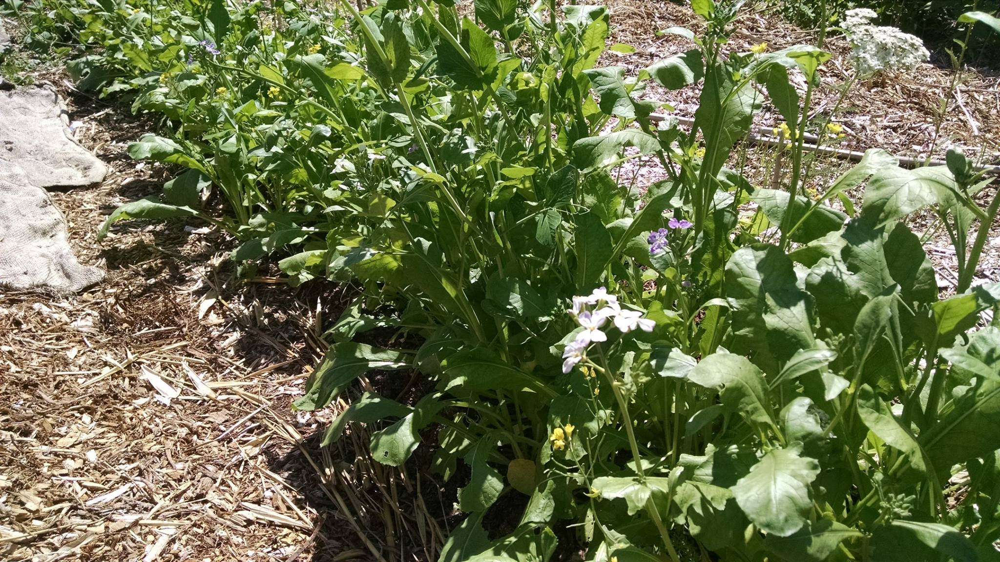
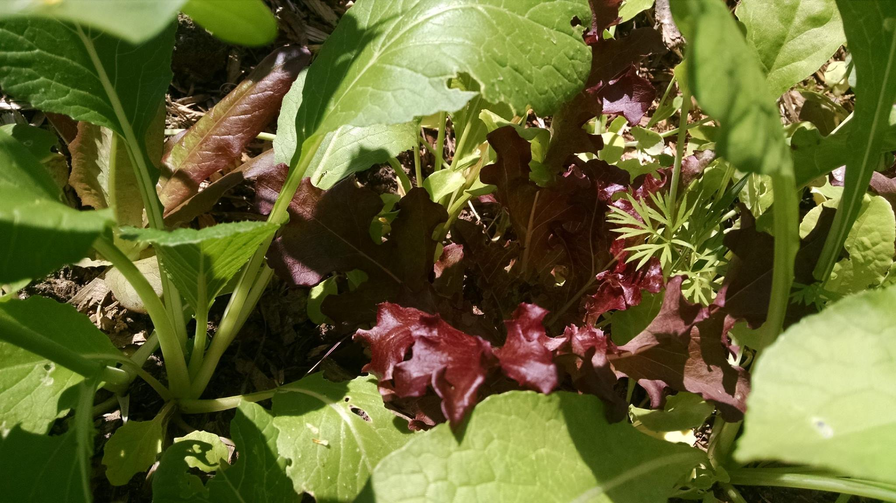
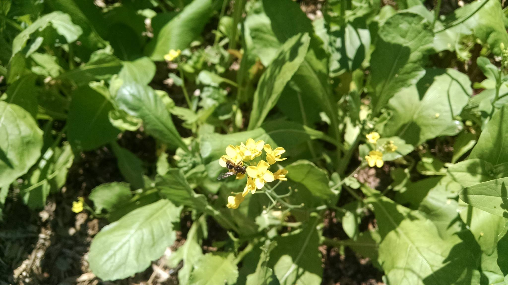
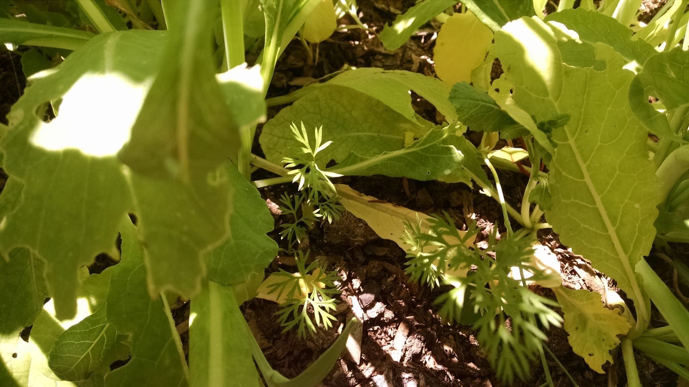
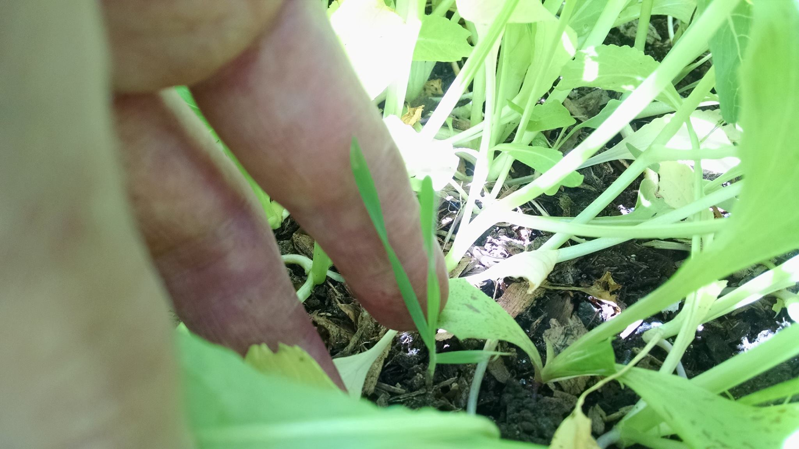

Title: Meadow Polyculture: baby plants
Date: 2018-07-05 17:44
Author: jpadvo
Category: Food
Slug: meadow-polyculture-baby-plants
Status: published

Previous post in this series: [Meadow Polyculture: Planting](https://www.echolakeresearch.org/2018/05/10/meadow-polyculture-planting/)

This thin strip was planted on May 10, with lettuce, spinach, daikon radishes, Joseph Lofthouse's bok choi grex, Chris Homanics's homesteader perennial kale grex, rainbow swiss chard, and komatsuna mustard greens. And Mountaineer perennial rye, Salish Blue and Ezeer perennial wheat. This is planted along a line of serviceberry bushes.

[caption id="attachment\_204" align="alignnone" width="2048"] The daikon radishes are bolting, making for deliciously spicy greens and flowers.[/caption]

I only watered in the first few days to make sure things germinated. Because we are in a local convergence zone, despite the fact that our region is in drought we have had quite a bit of rain, so it is extra lush!

[caption id="attachment\_205" align="alignnone" width="2048"] Beautiful red lettuce and a little baby carrot nestled under the bok choy and radishes. The shade will help the lettuce stay nice and sweet as we start having more dryness and heat.[/caption]

I am fast forwarding the succession process from bare soil, to pioneer plants, to grassland, to shrubland. This is done by planting all the stages at once, and harvesting to thin as needed.
[caption id="attachment\_206" align="alignnone" width="2048"] The bok choy mix from Joseph Lofthouse is highly diverse, so some are bulking up nicely and others are bolting already in the heat. Great for pollinators! See the little native bee?[/caption]

Overall I am very, very pleased with the results. I planted later than I would have liked (this has been a crazy year), and slugs did a number on a lot of the baby seedlings, but now you can hardly tell!

[caption id="attachment\_207" align="alignnone" width="2048"] The carrot seeds need uniformly moist soil. Because they were scattered on top, they did not sprout much until the other veggies grew up enough to provide some cool shade that coincided with rain.[/caption]

It's a jungle in there! I could have been thinning this bed a lot more, and probably soon I will harvest a lot of greens to blanch and freeze for convenient cooking later.

Needless to say, I have not needed to weed this. There is no space for weeds!!

Stay tuned for the next veggie bed I'll be planting, though... which will be predominantly host weeds. I'm going to even transplant weeds from my driveway into the new bed. Many of our lowliest weeds are actually the most nutritious, resilient and tasty crops we can grow.

[caption id="attachment\_208" align="alignnone" width="2048"] And here is a long term resident - a perennial grain! It is hard to tell at this point, but I believe it is one of the wheats. Not pictured is the perennial kale, the other notable long term resident.[/caption]

