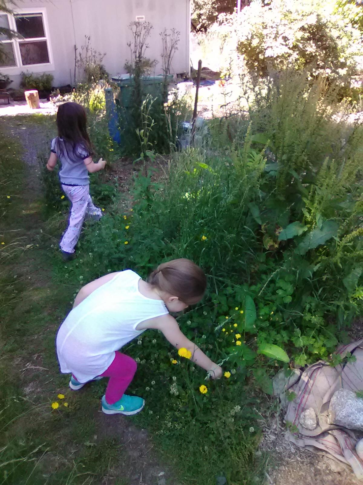

Title: Sowing weeds!
Date: 2018-07-11 17:49
Author: jpadvo
Category: Children
Slug: sowing-weeds
Status: published

I just discovered one of the very, absolutely bestest joys of gardening with weeds. I can tell the kids "go plant some seeds". They wander around, finding seeds, and planting them wherever they want to.

It doesn't matter what seeds they plant\*, or where, because we'll use what grows! Almost everything they plant is edible for us, most of it is medicinal, and all of it will only grow if there is an unfilled ecological niche that needs something growing there.

Of course, you can do this with any plants, it doesn't have to be just weeds. You can teach them to eat fruit and berries and spit the seeds to grow more. And if you let your regular veggies go to seed, you can also let them gather and scatter those. Doesn't have to be only weeds! It's just... the weeds are so happy to be here. It is great fun.

Pictured: garden elves harvesting seeds from a pile of compost that we've let grow. It is incredible! This little pile has:  
- two species of sonchus  
- a little nettle plant  
- lots of clover  
- a handful of dock plants  
- some dandelion and hairy cat's ear  
- fireweed and northern willowherb  
- heal all  
- two kinds of plantain  
- herb robert  
- a mighty bull thistle.

It has some grass and buttercups too, but that's not the end of the world. Also some elderberry cuttings I stuck in there to root. It is a riot!

And as we keep adding more diversity to the land, our weeds will become even more diverse, fascinating, and USEFUL. I have done nothing to this compost pile except help unload it from a pickup truck... and then leave it alone to flourish. We've harvested food from this for over a month, and now seeds! Later we'll dig the wild rootcrops, and transplant things like the nettle.

This is the life! [\#donothinggardening](https://www.facebook.com/hashtag/donothinggardening?source=feed_text&__xts__%5B0%5D=68.ARAHTZBw1TM3bzk0yhLfekJKGUK_VtXPJCiKDrhPvvupnAA4-8l-js-5CsreJqfuAZI8NWhfWuRAounriz0rcaqQ_kGe3pMDqR4TBJwD3b_R757_RhRGady6B49kQbNlEyN3Y9pes1Wt&__tn__=K-R) [\#pnwnaturalgardening](https://www.facebook.com/hashtag/pnwnaturalgardening?source=feed_text&__xts__%5B0%5D=68.ARAHTZBw1TM3bzk0yhLfekJKGUK_VtXPJCiKDrhPvvupnAA4-8l-js-5CsreJqfuAZI8NWhfWuRAounriz0rcaqQ_kGe3pMDqR4TBJwD3b_R757_RhRGady6B49kQbNlEyN3Y9pes1Wt&__tn__=K-R)

\* Well, I ask them not to plant grass seeds, cause we can't eat much of it and it does spread in an annoying way. But it isn't the end of the world if they plant a little grass...

We are spreading grasses that give us edible grain, though. It's mostly just turf grass or reed canary grass I give the stink eye.

