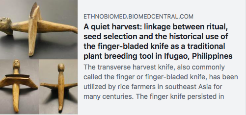

Title: AI Lesson: When the Sickle Was Disruptive Technology
Date: 2018-02-19 16:27
Author: jpadvo
Category: Society
Slug: ai-lesson-when-the-sickle-was-disruptive-technology
Status: published

Discarding old ways because they are "inefficient" with time is blind if those ways were optimized for things more important than speed. As AI continues to look over more jobs, this becomes an ever more relevant lesson.

The moral and societal implications of tools replacing human workers is not new. [Here](https://ethnobiomed.biomedcentral.com/articles/10.1186/s13002-016-0124-9) is an example of the \*sickle\* being a disruptive technology that caused poverty and societal disruption. Hard to believe, but true:

> When sickles replaced the centuries-old, traditional finger knives on the Indonesian island of Java, rice production increased; however, so did poverty and malnutrition, primarily among women and children. It was suggested that the finger knife was more than simply a tool for harvesting rice; because it was time-consuming and labor intensive compared to the sickle, it also served as a tool for a more village-wide, equitable distribution of rice.
>
> Larger farmers relied on landless villagers for harvest, thus providing them with a seasonal income, a share of the harvest, and a means of livelihood. With the introduction of the sickle, entrepreneurial harvest teams went from village to village to quickly perform the work that previously had been the responsibility of the landless poor.
>
> The rearrangement of social interactions that accompanied the change in harvesting technology from the finger knife to the sickle strained formerly cordial social interactions and encouraged political unrest and the widening of the gap between the wealthy and the poor.
