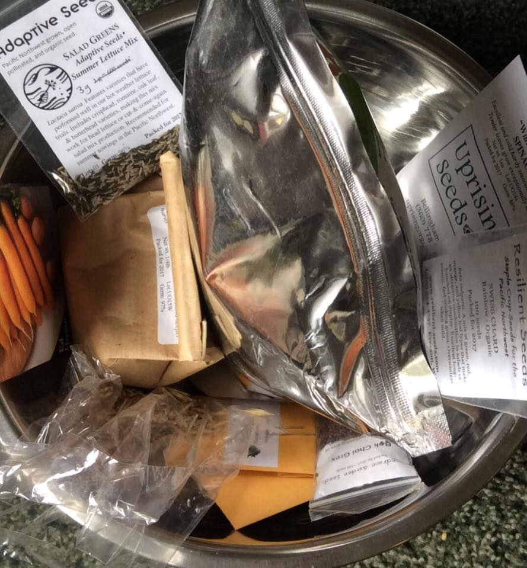

Title: Meadow Polyculture: Planting
Date: 2018-05-10 17:20
Author: jpadvo
Category: Food
Slug: meadow-polyculture-planting
Status: published

Next post in this series: [Meadow Polyculture: baby plants](https://www.echolakeresearch.org/2018/07/05/meadow-polyculture-baby-plants/)

I am planting a vegetable meadow strip! I will be scattering Mountaineer perennial rye, Salish Blue and Ezeer perennial wheat, carrots, lettuce, spinach, daikon radishes, Joseph Lofthouse's bok choi grex, Chris Homanics's homesteader perennial kale grex, rainbow swiss chard, and komatsuna mustard greens.

Basically, I'm planting a wildflower meadow... but the wildflowers are all annual or perennial vegetables, and the grasses are grains. I'll harvest most of the annual veggies as thinnings for baby greens, leaving behind the perennial grains and some perennial vegetables for the long term. I'll regularly scatter annual veggie seeds there (or let some go to seed), so that whenever conditions favor the growth of weeds, I'll get crops of baby greens.

It is very much Masanobu Fukuoka style in spirit, but on my small plot space is precious so I'm combining it with a very meager take on an [Ianto Evans style salad polyculture](https://www.chelseagreen.com/2012/start-a-polyculture-now-toss-a-salad-tomorrow/).

When I have my act together more, I aspire to do full blown Ianto Evans polycultures, phased seamlessly into populations of highly diverse perennial meadow species,

It'll be fun to watch this grow!

We received a TON of woodchips this year at our house, and covered half of my front yard with them a foot deep. The little strip we have planted in this polyculture had the chips pulled mostly back with the existing vegetation dead, and a layer of compost applied. Very input intensive, but we have woodchips and compost inputs en masse here, so we are using them to kickstart the organic matter in the soil! These inputs are not necessary for the ongoing health and development of our soil.
