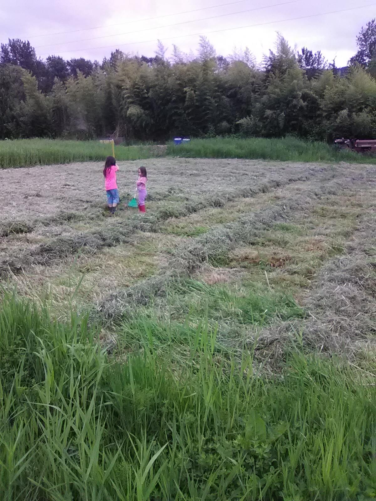

Today we planted the 113 mounds in the three sisters patch that we are growing with [Rainysunday Ranch](https://www.facebook.com/rainysundayranch/?fref=mentions&__xts__%5B0%5D=68.ARAVT8JvBXBbjnN3h7ZRfEUbQYGIbKG_UiRpBcKJ5a8N0Xk21MuYiHLhzk4AqDTJjlu01pbGJ_RmtbuCLD2I2zYw4LDKBhOC25mTBqdGFGQp9raNB3cBvHvC-yY9jz5Wa-UO5HHDRs8z&__tn__=K-R) at [Scottish Thistle Farm](https://www.facebook.com/ScottishThistleFarm/?fref=mentions&__xts__%5B0%5D=68.ARAVT8JvBXBbjnN3h7ZRfEUbQYGIbKG_UiRpBcKJ5a8N0Xk21MuYiHLhzk4AqDTJjlu01pbGJ_RmtbuCLD2I2zYw4LDKBhOC25mTBqdGFGQp9raNB3cBvHvC-yY9jz5Wa-UO5HHDRs8z&__tn__=K-R)! That was a lot of seeds.

Next post in this series: [2018 three sisters: germination!](https://www.echolakeresearch.org/2018/06/13/2018-three-sisters-germination/)

[caption id="attachment\_191" align="alignnone" width="1200"] Preparing for a three sisters planting. The little munchkins are helping make the slashmulch piles, which we will top with a little compost and plant directly into.[/caption]

This is a slashmulch system. The existing vegetation was mowed, then we gathered it into mounds that are deep enough to smother the vegetation underneath. Ideally, this happens a month before planting so the corn/bean/squash seeds go into a fairly decomposed mulch. If necessary the areas between mounds can be mowed once or twice while the squash spreads out.

The mulch provides weed control, helps keep the soil moist, fosters soil food web activity that softens the soil... and provides a kick of nitrogen for the heavy feeding corn and squash. And the beans, of course, fix nitrogen to replenish whatever is going away, along with any leguminous plants that are growing as "weeds" between the mounds.

Smaller seeded crops can be planted by making slashmulch mounds/beds, and then raking the mulch away once the underlying weeds are dead (or mostly dead).

What did we plant?
==================

Cascade Ruby Gold corn is the soul, and is the only corn variety in this patch.

We planted 35 kinds of squash, anchored with a dozen and a half mounds each of Nanticoke landrace from the [Experimental Farm Network](https://www.facebook.com/ExperimentalFarmNetwork/?fref=mentions&__xts__%5B0%5D=68.ARAVT8JvBXBbjnN3h7ZRfEUbQYGIbKG_UiRpBcKJ5a8N0Xk21MuYiHLhzk4AqDTJjlu01pbGJ_RmtbuCLD2I2zYw4LDKBhOC25mTBqdGFGQp9raNB3cBvHvC-yY9jz5Wa-UO5HHDRs8z&__tn__=K-R) and Goldini zucchini gifted by Charlotte Anthony, 4 mounds each of cinderella, bushel basket gourds, and two varieties of hulless pumpkins for pepitas.

We planted 6 varieties of beans, anchored with \~60 mounds of Pellegrini beans saved by Cody Lee Johansen of Rainysunday Ranch last year, and \~20 mounds of White Half Runner beans recommended by [Timothy Kercheville](https://www.facebook.com/profile.php?id=100004176543395&fref=mentions&__xts__%5B0%5D=68.ARAVT8JvBXBbjnN3h7ZRfEUbQYGIbKG_UiRpBcKJ5a8N0Xk21MuYiHLhzk4AqDTJjlu01pbGJ_RmtbuCLD2I2zYw4LDKBhOC25mTBqdGFGQp9raNB3cBvHvC-yY9jz5Wa-UO5HHDRs8z&__tn__=K-R).

Thanks to Jody Kerr for use of this field, and to [Mike Hoag](https://www.facebook.com/profile.php?id=100010704363250&fref=mentions&__xts__%5B0%5D=68.ARAVT8JvBXBbjnN3h7ZRfEUbQYGIbKG_UiRpBcKJ5a8N0Xk21MuYiHLhzk4AqDTJjlu01pbGJ_RmtbuCLD2I2zYw4LDKBhOC25mTBqdGFGQp9raNB3cBvHvC-yY9jz5Wa-UO5HHDRs8z&__tn__=K-R) for the information he has been sharing about their slashmulch plantings, and the coaching and questions answered.

And thanks Dad for helping to put the seeds in the ground and keep the kids happy!

What do we hope to accomplish?
==============================

Part of this is a variety trial to see which squash can survive whatever kinds of pest pressure exist in this context! Also, with two squash planted for \*every\* mound, we are going to have \*tons\* of squash. If 3/4 of them get obliterated, we'll probably still have plenty.

Next year we'll probably plant the squash less densely, but this year part of the deal is to let them duke it out, and also to get as much coverage over the reed canary grass as possible, as fast as possible so that we don't have to mow between the mounds too much.

More info
=========

Mike Hoag has a neat instagram gallery showing their slashmulch plantings:

[embed]https://www.instagram.com/p/BftOvSGhZ24/[/embed]

 

