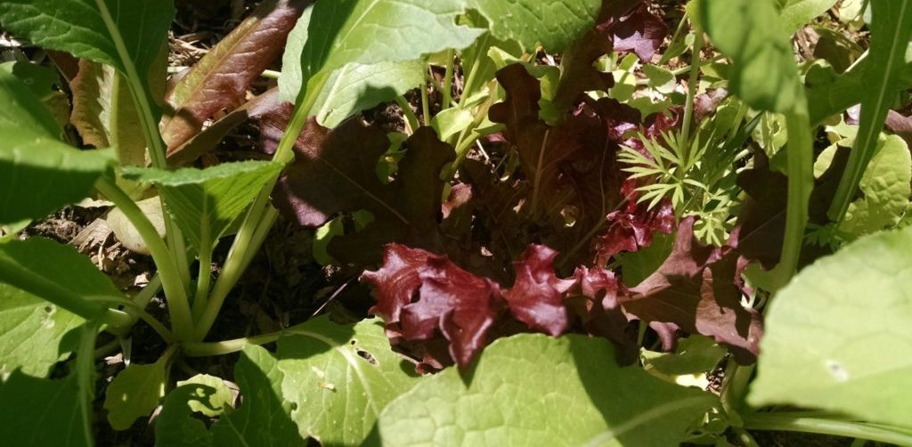
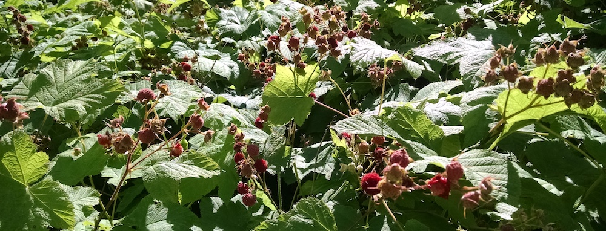
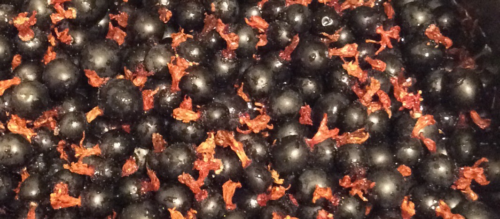
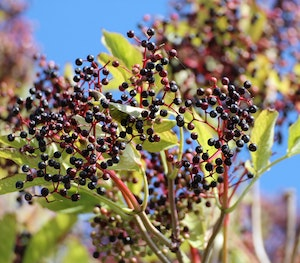
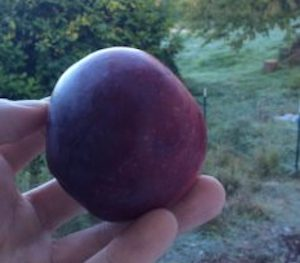
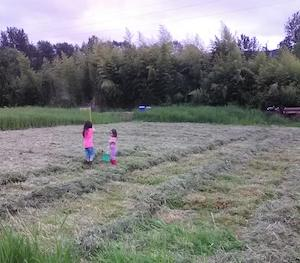

Our mission is to help the Echo Lake neighborhood and surrounding communities connect together around better food, stronger community and more resilient living. We offer free how-to guides (some now, more coming!) and online webinars, and lead foraging walks and hands-on workshops. You can sign up to [get updates via email](https://eepurl.com/gg_Oev) or on [Facebook](https://www.facebook.com/EchoLakeResearch/).

Our emphasis is on finding practices that are easy to learn, forgiving to put into practice, and simple enough to become part of ordinary life. Read on to learn about the focus areas we are working on!

## Kitchen

The best food is homemade, and we find ways to make it easy. We mostly cook without recipes, instead using simple patterns so that the food can flexibly adapt to what is in the garden and fridge. Sourdough bread, lactofermented veggies, kombucha and homebrew all have places of honor in our kitchen, and we have beautifully simplified ways to do all of those things.

## Health

## Garden

We use a variety of approaches to make gardening more rewarding less work. Building living soil allows less watering, learning edible weeds changes them from a problem into a harvest, and sowing thick polycultures allows a leisurely style of plant once, harvest continually gardening. Growing fertility in the garden saves money on buying compost or fertilizers, and preserving an intact ecosystem and growing locally adapted seeds solves insect issues.

## Orchard

Probably the most bang for the buck growing food at home is in an orchard planted like a natural ecosystem. By using natural patterns we can almost entirely do away with weeding, significantly reduce pest issues, provide fertility, and harvest much more food! Because far more than just fruit and nut trees, our orchards can hold an enormous variety of annual and perennial vegetables, herbs, berry bushes pollinator plants, vines, ground covers, and root crops. This style of orchard is often called a "food forest" or a "forest garden", but unlike our native PNW forests, these orchards typically have a savannah-like distribution of trees to allow sun to filter through on all the other plants.

## Wilds

## Design

## Focus areas

| [ Gardening](./gardening) |      | Health            |
| :----------------------------------------------------------- | ---- | ------------------------------------------------------------ |
| Convenient classes that give you practical skills to build a more local, resilient, community centered life. Get more food, medicine and joy from your garden with less time and a smaller budget! These classes and workshops are designed to make an immediate impact in your life. [Learn more...](./gardening) |      | Elderberries are one of the most important medicinal plants we can grow. They are attested to by modern science and thousands of years of tradition. We are on a mission to organize planting them by the thousands, using them as a stepping stone to transform the health of our families and communities. |

 

| Community                 |      | Food               |
| ------------------------------------------------------------ | ---- | ------------------------------------------------------------ |
| We are developing simple resources for a grassroots program to help you vitalize your community, starting with simple and rewarding steps in your own neighborhood. We can rediscover the tight-knit communities that we are made for. |      | We are collecting, growing and breeding some of the most delicious and toughest crops that exist for our region. From perennial grains and drought tolerant corn to heritage fruit trees and prickly pear, and things you've probably never heard of before! |

 

| Crops              |      | Permaculture Design |
| ------------------------------------------------------------ | ---- | ------------------------------------------------------------ |
| We are collecting, growing and breeding some of the very toughest staple crops that exist for our region. From pest resistant potatoes to drought tolerant corn, and from perennial grains to uncommon staples like sunroots. |      | Agroforestry is managing forest land to produce food, medicine, and other high value products in addition to lumber. We want to meet landowners with acreage in or near the Echo Lake area who are interested in exploring in agroforestry work with us. If that sounds like you or someone you might know, please contact jason@echolakeresearch.org! |

