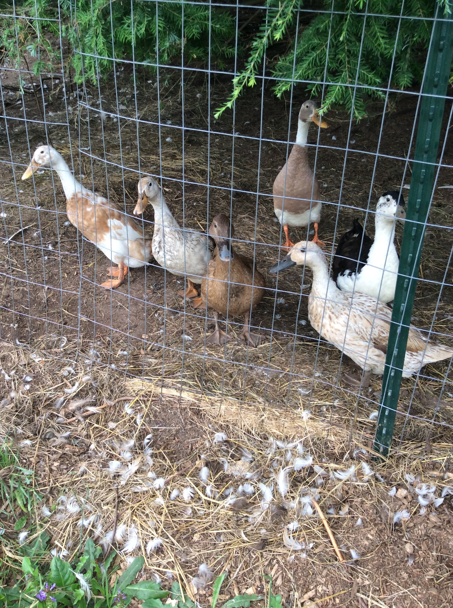
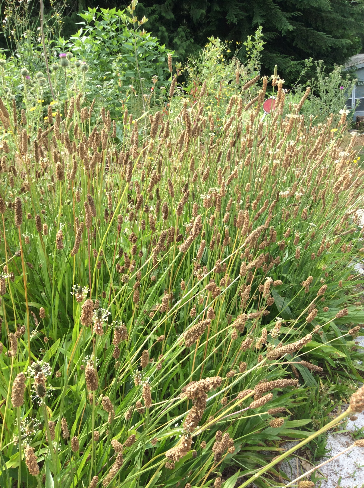
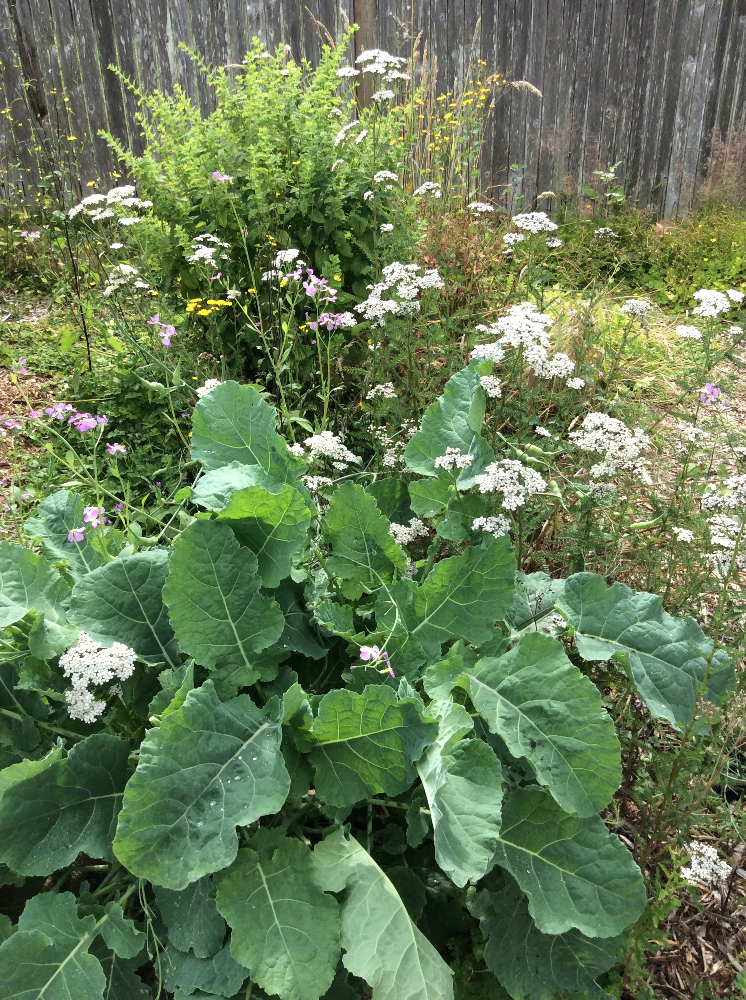

# Joyful Emergency Preparedness Gardening

I don't often talk about catastrophes, crises or emergencies, but we had an earthquake last night and that is a good prompt to do so!

Having stores of food is good. Crucial, in fact. One way to store food is with cans, 50 pound bags of beans and flour, stuff like that. We have some of that stuff, and rotate it through regular cooking so it stays fresh. Freeze dried stuff can be tasty albeit a bit $$$ and processed. Although it is not food, prescriptions especially should definitely be stocked up, if you need them.

But... it is way, way nicer the more you can store food in the garden. Not just growing it, but *storing* it in the garden. I'll talk about how to do that in a spell, but first the advantages. There are many, many benefits to building an emergency stash in the garden:

1. It is FRESH. Preparing food fresh from the garden is simply the best possible food available. During an emergency, I would much rather be eating the best food imaginable than something reconstituted.

   

2. It is FREE. Wonderfully fertile gardens can be started with streams of waste: wood chips, food scraps or aged manure from Mary Anne Campbell's place. Send her a PM if you can haul manure from the Maltby area.

   

3. It is SELF REPLENISHING. If you plant the right stuff, as you harvest it propagates. As you maintain it is fertilized. No need to irrigate, buy, stack, ship or store. So much happens automatically.

   

4. It is JOYFUL. This is a biggie! It is well documented by science and anybody's direct experience that our hearts are lifted and spirits clarified when we connect to nature in a meaningful way. We don't have to focus on emergency preparedness as we garden... we can just focus on gardening. There are so many reasons to garden - health, economics, community, healing and many more. When we stash emergency food stores we are focused primarily on *one* thing: prepping for scary stuff. But in gardening the prospect of dark times takes its useful place as an important but minority cast member in our daily thoughts.

   Stashing stuff hunkers us down. Gardening lifts us up.

   

## How to store food in the garden

The general idea is to have certain kinds of foods that can be harvested in quantity for sustenance, year round. And past that, to have sufficiently invested in an ecosystem for the garden so that it does not need continuous external inputs to unfold the food stored as potential in the ecosystem. For me, this conception of storing food in the garden has three time scales:

1. Things we can harvest at any given moment.

   Something like perennialized potatoes or sunroots that we can dig at pretty much any time of year. For calorie crops this kind of storage is particularly important. Finding a variety of potato that will overwinter nicely and be available through harvest at almost any point of the year takes some experimenting for different sites. Pests and diseases can be different from garden bed to garden bed.

   Sunroots (aka jerusalem artichokes) are much more resilient in our climate. As long as you harvest them each year they will produce well, and they produce as many calories per acre as potatoes while also producing abundant biomass to feed the garden. They can be dug at full size from fall through spring. To some degree during the summer, probably, but the potatoes are coming in strong then anyway.
   Groundnuts (Apios americana) are a crop I'm optimistic about here, but still getting to know. It fixes nitrogen and makes edible tubers. Every year, the tubers get bigger, without getting fibrous or bitter. They literally will just store more and more food, and can be harvested year round.

   Perennialized garlic, multiplier onions, and egyptian walking onions provided delicious allium flavors year round, with the season determining if the best harvest is bulbs, bulbils, or greens. 

   Perennial kale can be harvested year round for delicious greens. In the spring perennial vegetables are prime, in the summer and fall the annual veggies are in full swing. In a forest garden setting, most annual veggies can be grown with very little fuss.

   There is a whole skill set to be learned of "winter gardening", where you time the plantings of common vegetables so that they size up just in time to go dormant as fall ends, and then sit at full size for harvest throughout the fall, winter, and early spring. Check out @PNW Winter Gardening and Farming group on Facebook.

2. Things that can be activated to produce food in short order. This is mostly relevant for the wintertime.

   

   For example, taprooted greens like dandelions can be dug and forced into shoots during wintertime for greens. The water, energy and nutrients are already stored and accumulated in the plant, but it can need time to convert to the form we want.

   Mulberry trees have edible leaves, and during the months of dormancy sticks can be cut, brought indoors and set in wet soil or water, and they will leaf out. The same can be done with bigleaf maple, linden, chinese toon, and any other edible leafed tree or shrub.

   Poultry are fabulously useful and can fall into category 1, 2, or 3, but I'll talk about them here. Our ducks and chickens are most useful for us in producing eggs. In the event of a disruption we would not be able to feed them supplemental grain, so they would lay less but they would still do fine with the bugs and weeds they eat. An earthquake will not eradicate the slugs! In an emergency we would probably allow the quail to start clutches of eggs for meat. I doubt we would get into a critical enough situation that we would eat any of our egg laying flocks, as they are beloved pets.

3. Fertility, water, and seeds/tubers/roots that are set up to produce food on their own.

   The resources are stored underground and cannot be rushed, but are more or less as securely at hand as a bottle of new wine set in the cellar to age. An example is a hedge of raspberry bushes set up to in a hugelkulture bed and not needing irrigation. They *will* make a ton of berries, almost guaranteed. When it is their season. All of the resources to make that food is sitting there in the garden, in processing.

   Some of these steps involve growing, but the point is that they are locked in and will happen on their own. We aren't having to break our backs planting, fertilizing, weeding or anything - we have a garden-turned-ecosystem that is prepared and will unroll the feast. Imagine a set of lockers with timed locks, and they open one after another each day to reveal more food.

   Perennial vegetables, herbs, fruits and nuts are the very most resilient items here. Self-seeding foods like arugula, lettuce, lambs quarters and such can also be quite resilient.

   Having diversity is an insurance policy here. If it is a bad year for cherries, it may be a banner year for blackberries. If it is a bad year for peas, it may be a great year for amaranth. If you fill the garden with life, and with fertility, the stuff that is happiest in the given conditions will take those resources and convert them to food and medicine.

   My favorite resource for making this kind of ecosystem gardening simple is @Lillie House and their website at https://transformativeadventures.org

---

Speaking of medicine... we should definitely stash vital prescriptions. You don't want to deal with running out of important medicine in the middle of an emergency.

A lot of things, though, like ordinary everyday stuff? If you can learn to use a handful of versatile herbs you can stock much of your medicine cabinet. Learn to use oregon grape, willow bark, elderberry, yarrow and plantain for common issues that you would typically use over the counter creams and pills for. Actually get used to using them! Do it in their simplest possible formulations whenever possible: as chewed up poultices and teas.

Just these 5 herbs will take you a loooooooong way towards having a reliable supply of powerful medicine in your garden that will be invaluable to have during a disruption.

And if you can find the right ND, they can do a lot to help you find the best ways to incorporate plant medicines and lifestyle changes into your treatments, so you can be more self-reliant in addressing your health. My friend Alicia Tremblay does that, and she ALSO does garden consults to help you learn how to grow, harvest, and prepare the medicines you are using.

---

Storing water and fertility in the garden is important, because in the event of a large disruption we can't expect to be hauling compost from offsite, or buying miracle gro, or even having municipal water or wells work.

Keeping a thick, 4-8 inch layer of rich mulch is the best way to build and store fertility, and build the rich microbial structures in the soil that turn it into a sponge to store our winter rains through the whole growing season. This mulch ideally comes from the garden itself - some plants like sunroots generate a lot of biomass to use as mulch. You can use cut branches, raked leaves, lawn trimmings and such too.

Making a hugelkulture bed can provide a huge sponge as the wood rots in the first year or two. These work especially well for berry bushes. Because of the work and resources, these are typically small, and most of the garden will need the mulch treatment.

---

Another important aspect of emergency preparednes is connection with neighbors. Gardening can be an incredible help to building community, as it provides natural times to connect. Seeing neighbors in the front yard, sharing plants and seeds, extra zucchinis and all that. In the event of The Big One, we will absolutely need to work with our neighbors to survive. Connecting ahead of time in the garden - in a realm of friendship and joyful abundance - will be important in ways we probably can't comprehend ahead of time.

---

It is well worth noting that there are simple, important basic steps towards resilience in addition to a suitable garden. Things that will simultaneously help with personal crises and dramatic stuff like earthquakes. Handsu down the best educator for this is Jack Spirko. Disclaimer - his political views curdle milk in a lot of directions and I'm not endorsing anything but the solid preparedness advice. A good listen to get started is here: https://www.thesurvivalpodcast.com/ten-basic-questions-1